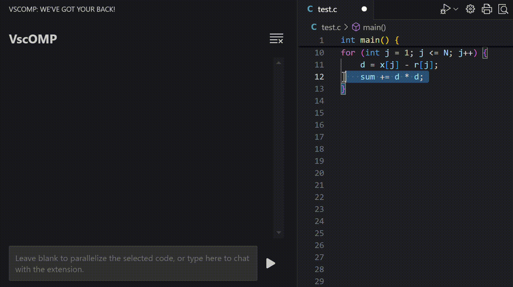

# LLMA4OpenMP - VScode

Developed  upon [RussellCanfield/wingman-ai](https://github.com/RussellCanfield/wingman-ai) .

## Settings

You can use the graphical config view inside a workspace.

Or you can edit the settings in settings.json

## Usage

Select the loop, then press "Send message"

